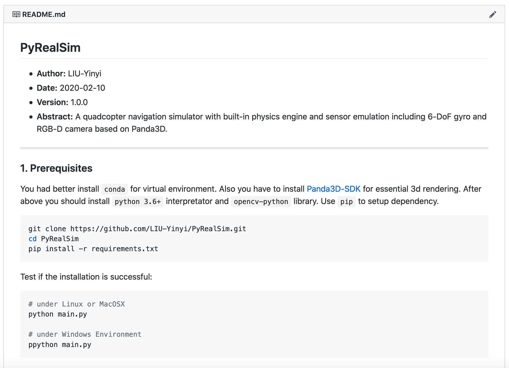
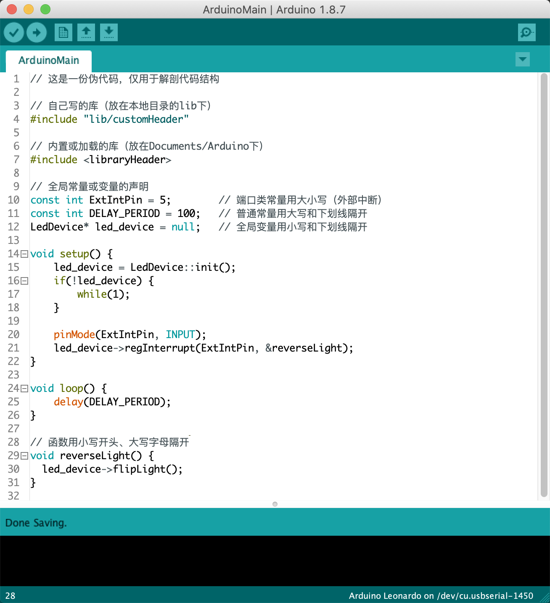
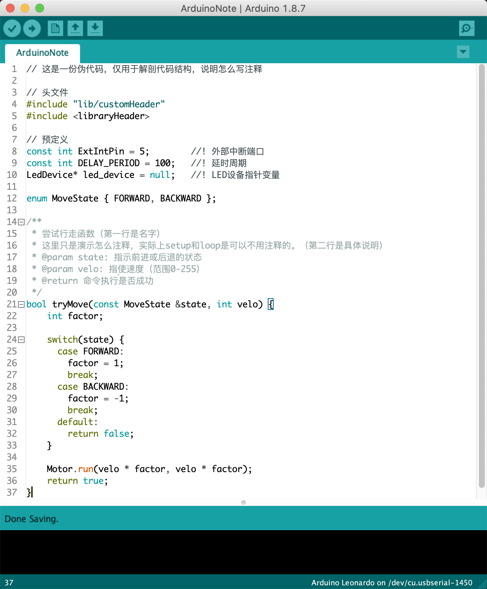

## 工程代码与说明规范（2020基本版标准）
- **日期：** 2020-05-01
- **作者：** 16级光电[@LIU-Yinyi](https://github.com/LIU-Yinyi)
- **版本：** B20（Basic standard-2020）
- **摘要：** 为后续所有上传至团队[@sysu-edc](https://github.com/sysu-edc)的工程提供代码code和说明readme的规范和标准，保证所有上传的开源工程的有效性、易读性，供后人也就是师弟师妹们高效学习或借鉴。

---

### 一、前言
首先说明这份规范的存在意义。    

经过四年本科，转眼即将毕业，回首我的四年，基本上碌碌无为。大部分时间除了学习新的知识，可以说都花在了重复_造轮子[1]_上。诚然，造轮子可以加深对底层的理解，然而这其实对于非立志于深度科研的人来说是十分浪费时间的。因此，造了一次轮子之后发现这个东西能work，就应该及时将这份代码以某种合适的标准_封装[2]_起来，使得下一次新工程要用到时可以方便地调用，避免做无用功。

另外，在三年的中大空中机器人团队（下文简称“空队”）的开发经历中，我发现了代码和说明如果没有规范，团队协作将是灾难性的。因此，这份规范是必要的。我在空队摸爬滚打中，逐渐认可和习惯了谷歌的代码范式，但是考虑到电设俱乐部面向的是大一、大二的学生，这样的要求可能是难以达到的，因此我觉得保留核心规范的可行性会更高些。

总而言之，为了使得中大电设俱乐部未来工程项目的可传承性，提出2020基本版标准B20是必要的。当然了，若后人发现本标准有瑕疵，可像C++11/14/17那样，在慎重考虑后完善为如B22/24等标准；对于要求更高的工程，可提出S类（Senior standard-XXXX）标准等。

> **给新人的批注：**   
> [1] 造轮子：原意指要制造汽车时先造轮子，表示完全从零开始，这里用来比喻每次新工程中都把很多重复性的基础工作又做了一遍。    
> [2] 封装：指把一个功能复杂的程序打包起来，只留出几个高度抽象、方便调用的接口，这样二次开发时就很高效。

### 二、说明规范
本章围绕的是怎么写readme的问题。

你看我这份说明是不是写得你觉得还能看？如果连说明写得都不能看，那么根本没人会看你的代码。即使有，也很难看懂，不满足我们说的高效移植。那么文档应该怎么写呢？

#### 1. 文档头信息
我们采用markdown语法，下面的你们可以直接复制，效果参见本文档开头。至少包含日期（最后一次更新的日期）、作者及链接（人们有疑问才能找你）、版本、摘要。

```
- **日期：** YYYY-MM-DD
- **作者：** [@LIU-Yinyi](https://github.com/LIU-Yinyi)
- **版本：** 1.0.0
- **摘要：** 简要说明这个工程干什么，谁适合使用，开发进度。
```

一般通用版本号`X.Y.Z`的确定：

- 从左往右第三位Z：小改动和更新，一般是修复bug用的；
- 从左往右第二位Y：添加了非颠覆性的新功能；
- 从左往右第一位X：一般涉及了API接口的大改动才需要更改，非Release版请从0开始计。

本文`B20`是个特例，所以需要在开头说明命名原因和迭代命名方法。

#### 2. 文档主体信息
你至少需要告诉别人：

- [x] 这个工程需要的开发环境和如何安装
- [x] 如何运行和使用这个工程
- [x] 如果是库，需要告知API和使用样例

可选的有：

- [x] 引用References（这其实是必要的，但鉴于大多数新生不会看论文，基本可忽略）
- [x] 致谢Acknowledge

例如，我们需要安装Git，可以写为：

```bash
sudo apt-get install git
```

更多工程的简单版readme可以参见我的工程：[PyRealSim](https://github.com/LIU-Yinyi/PyRealSim)



### 三、代码规范
本章围绕的是怎么设计代码结构、变量函数命名和注释的问题。

考虑到中山大学电子设计俱乐部的大部分成员为大学一年级或大学二年级，涉及到的开发语言多为C/C++、Python、Matlab、Verilog HDL、ASM（汇编）。当我还是大一的时候，我们还用到了Visual Basic和C#，不过现在转unix系统后很少用了（主要是忘了），因此暂时忽略。

#### 1. 关于C/C++
这里以新生都比较爱用的Arduino为例。


归纳为：   

- 端口常量用大小写字母，大写用于分开单词
- 普通常量用全大写字母，下划线用于分开单词
- 变量用全小写字母，下划线用于分开单词
- 函数过程用大小写字母，以小写字母开头、大写用于第二个单词以后分开单词

*Note:* 上面那份伪代码中，实际上`reverseLight()`若放在结尾是会报错的。大型功能类的函数我们推荐另起一个文件，如所有的中断处理函数都放在`InterruptProcess.ino`中，然后再从`ArduinoMain.ino`中调用。

约定俗成的简称：

|简称|全称|含义|
|---|---|---|
|idx|index|序号（用来局部变量代替i，因为i可能是虚数单位）|
|init|initialize|初始化（多用在class的构造上）|
|intr|interrupt|中断（单片机的中断）|
|tx/send|transmit|传输（通信设备发送）|
|rx/recv|receive|接收（通信设备接收）|
|row|row|行（图像处理的遍历行）|
|col|column|列（图像处理的遍历列）|
|reg|register|注册（我一般用来表示注册函数指针）|
|buf|buffer|缓冲区（通信设备预留的缓冲区变量）|

#### 2. 关于Python/Matlab
因为Python和Matlab实际上是比较相似的，因此我们放一起讲。理论上，这也是套用上面的，但是根据PEP8的标准会有些冲突，如函数命名为`func_exec()`而非上述C/C++的`funcExec()`。这方面的文章较多，[中文版简书介绍](https://www.jianshu.com/p/ffcc66bab3ce)，[官方英文说明](https://www.python.org/dev/peps/pep-0008/)，这里不再赘述。

#### 3. 关于ASM（汇编）
我想了一下，这玩意从微机原理这门课开始，自己写的代码别人基本上是看不懂的，即使加了注释，我宿友都懒得抄我的作业的那种。这东西注定就是自己写自己改，而且过段时间自己都不一定能看懂。干脆佛系好了。现在除了加速和紧凑式压榨性能的开发，应该用不上汇编。虽然说考试用得上，但怎么说也是一次性的嘛（不是

### 四、注释规范
本章围绕的是怎么写注释的问题。



### 五、后记
更多请参考：[Doxygen Official Docs](doxygen.nl)